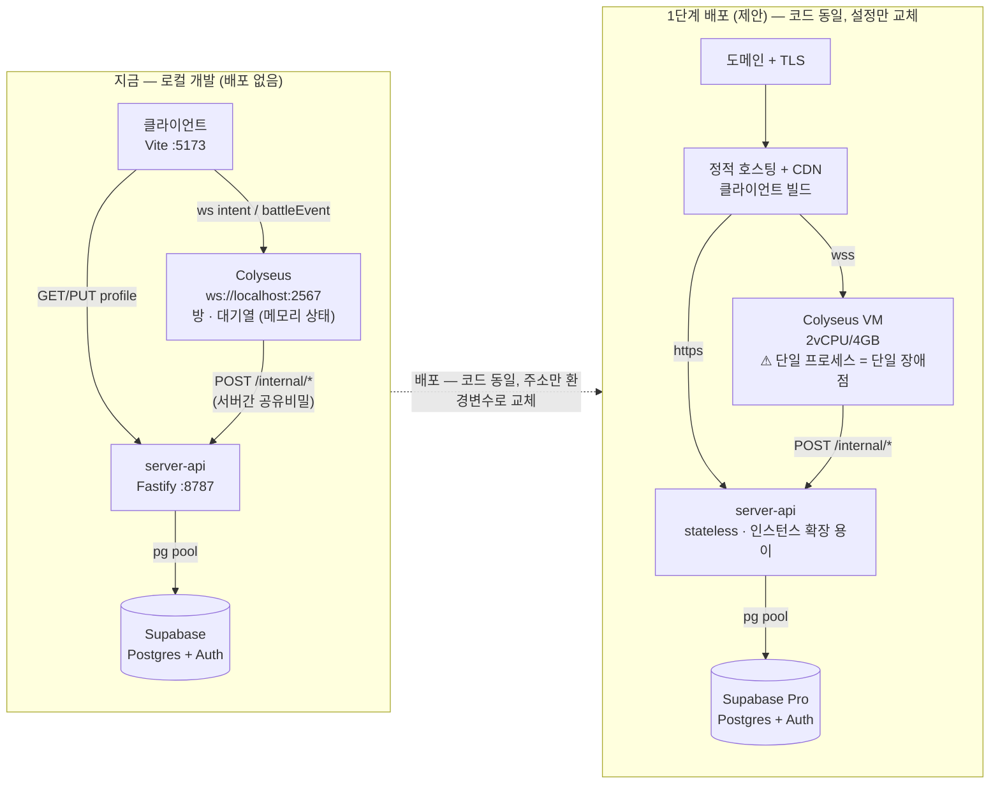

# 삼국 약식 체스 — 개발·인프라 보고서 (약식)

> 대상 기간 2026-07-31 ~ 2026-08-24. 정본은 [`HANDOFF.md`](../HANDOFF.md) ·
> [`작업계획.md`](작업계획.md) · [`history/`](../history/)이고, 이 문서는 그 셋을 훑어
> 다섯 물음에 답하는 **요약**이다. 전체 분량(표·비용 세부 항목 포함)은 이번 세션에서
> 발행한 아티팩트 쪽이 더 자세하다 — 여기는 docs에 남기는 축약본이다.

## 1. 개발 스펙과 인프라

- **TS 모노레포**(npm workspaces), Node 22.6+ 타입 스트리핑(번들 단계 없음). 룰 엔진을
  서버·클라이언트가 같은 코드로 돌리는 것이 스택 선택의 1순위 기준.
- 전투 렌더 Phaser 3 · 메타 UI React · 실시간 Colyseus(`packages/server`) · 계정 API
  Fastify(`packages/server-api`, Colyseus와 완전히 분리된 프로세스) · DB Postgres
  (Supabase 호스팅, Transaction Pooler) · 인증 Supabase Auth(이메일).
- **지금 실행되는 프로세스 넷**(클라이언트·Colyseus·server-api·Supabase) **전부 로컬/개발
  전용이다.** 배포(도메인·TLS·프로세스 관리·CORS)는 의도적으로 다음 단계로 미뤄 뒀다.
- 룰 엔진은 `Date.now()`/`Math.random()`을 안 쓰는 결정적 함수라 "판이 끝난 뒤 재생해서
  검증"이 가능하고, 이게 AI 대전 결과의 서버 검증(H3c)을 성립시킨다.
- 검증 체계 5개 층 + 파이프라인 자체 검증. **단위 테스트 429/429 통과(32 스위트, 직접
  실행 확인)**, `smoke:ui`/`smoke:meta`/`smoke:online`/`smoke:account` 전부 통과 상태.
  코드 규모 약 3.7만 줄(TS).

## 2. 지금 몇 명이 쓸 수 있는가

- **결론: 사실상 0명.** 공개 배포가 없다 — `packages/server`의 부팅 주석 자체가
  "로컬 개발만"이라 명시하고, `npm run server`로 개발자가 직접 띄운 뒤 브라우저
  탭/프로필 둘을 붙이는 것이 지금 온라인 대전을 확인하는 유일한 방법이다.
- 다만 **AI 대전은 서버 없이도 완결**된다(설계 원칙) — 혼자 하는 플레이는 이미
  아무 인프라 없이 가능하다. 서버가 필요한 것은 로그인/계정 영속화와 사람 대 사람
  온라인 대전 둘뿐.
- 지금 코드를 그대로 배포한다면(실측 아님, 구조 기반 추정) — Colyseus 방 서버 한 대로
  동시 대전 수십~100+판 규모는 구조상 무리 없어 보이나, **부하 테스트를 한 번도
  돌린 적이 없다.** 실제 상한은 Colyseus 단일 프로세스(수평 확장 미비)와 Supabase
  요금제의 동시 연결 한도가 정할 것이다.

## 3. 향후 인프라 확장과 클라우드 운영비 (이번에 새로 제안 — 확정 아님)

| 단계 | 목표 | 무엇이 더 필요한가 | 월 비용(추정) |
|---|---|---|---|
| **1. 검증** | 수백 DAU, 도메인으로 첫 공개 | 지금 구조 그대로 소형 VM 1~2대 + 관리형 Postgres | $50~90 |
| **2. 성장기** | 수만 DAU | Colyseus 다중화 — `@colyseus/redis-driver`/`redis-presence` + WS 인지 LB, Redis, Postgres 스케일업, CDN | $300~800 |
| **3. 성숙기** | 글로벌·대규모 | 다중 리전 오토스케일, Postgres 복제/DR, 글로벌 CDN·WAF | $1,500~5,000+ (PG 수수료·CS·현지화 별도) |

- **Oracle Cloud Always Free**(ARM 4 OCPU·24GB, 무기한 무료)가 1단계 컴퓨트 비용을
  사실상 없앨 수 있어 검증 단계에 실질적으로 유리하다.
- AWS는 성장기 이후 ElastiCache/RDS/ALB 조합이 가장 성숙, GCP는 `server-api`(무상태)를
  Cloud Run 서버리스로 돌리기 좋음, Azure는 특별한 우위 없음.
- 채택 전 반드시 재확인: Supabase 프로젝트 요금제·동접 상한, 실제 부하 테스트 1회.

### 그림 — 개발·배포 환경 (1·3절 종합)

왼쪽은 **지금**(로컬 개발, 배포 없음), 오른쪽은 **1단계 배포**(제안) — 같은 코드가
주소·설정만 바뀌어 그대로 올라간다. Colyseus는 아직 단일 프로세스라 배포 후에도
단일 장애점이며, 2단계에서 Redis 좌표 계층을 넣어야 다중화된다.

아래는 3절의 확장 경로를 그대로 옮긴 것 — 1단계(제안 배포 대상, 강조)에서
2·3단계(아직 미착수, 점선)로 이어진다.

## 4. 8월 로드맵 보고서 (주간 → 월간)

| 주차 | 기간 | 내용 |
|---|---|---|
| 1주 | 07-31~08-02 | GDD 통합·기술 스택 확정·데이터 파이프라인·룰 엔진(CTB·Effect DSL·고유기술 40종)·밸런스 하네스 |
| 2주 | 08-03~08-09 | Phaser 전투 씬 1·2차 + **오프라인 풀 사이클 완결**(계정~레벨업) |
| 3주 | 08-10~08-16 | 액션 시트 260명·전투 연출, 카드/커맨드패널/카메라, 시각효과 30종·지형 3종, 전투화면 리디자인, BGM 5곡, 간판/도시/자리 화면+다국어 틀 |
| 4주 | 08-17~08-23 | **메타 게임 9화면**(PPT 37~45) 완결 + **Colyseus 온라인 대전 트랙 전체**(H1~H3d, 계정·참가비·전투 보상·군량 충전까지 서버 권위화) 같은 주 안에 완료. 트랙 9(상점/가챠) 가격 정책 사전 논의 |
| 진행중 | 08-24~ | 코드 밖 콘텐츠 자산 대량 확보 — 인물 서사 219명×9개 언어, 고유기술 음성 일부, BGM 3곡 추가. **아직 파이프라인에 미연결** |

이번 달 숫자: 단위 테스트 0→429건, 화면 0→20개 이상, 서버 프로세스 0→2개.
4주 반 만에 "계정 생성 → 온라인 대전 → 서버 검증 보상"까지 세로 한 줄이 섰다.

## 5. 9월 개발 계획

우선순위 순 (착수 전 기획자 확인 필요):

1. **G1 인물 서사 연결** — 219명×9개 언어 자료가 이미 있고 `OfficerData.story?` 자리도
   이미 뚫려 있어 저비용·고효과. 엑셀 열 추가 → 추출기 → 화면 노출. 219명 vs 실제
   장수 260명의 차이(41명)부터 확인.
2. **다국어 실배선** — `i18n` 문구(한국어만 채움) 번역 채우기, 고유기술 음성(40종×5개
   언어 중 3종만 있음, `가후지잭` 오타 정정) 마저 확보, 신규 BGM 3곡(상점·무승부·패배)
   `bgm.ts`에 연결. 화면 i18n(5개 언어)·인물서사(9개)·음성(5개, 구성 다름)의 지원
   언어 범위를 한 번 맞출 것.
3. **트랙 9 — 상점/가챠/랭킹/결제** — 가격 정책 초안(카드 등급 재편·2단계 가격·
   유한 배열 가챠)을 `economy.json`/GDD에 반영. 결제 범위(모의 vs 실 PG)는 아직 미정.
4. **실서비스 배포 착수** — §3의 1단계를 실제로 밟는다(도메인·TLS·Supabase 요금제
   확인·부하 테스트 1회). 코드가 아니라 설정만 바뀌도록 이미 설계돼 있음.
5. **낮은 우선순위** — G2(시설: 병원·황궁), G3(튜토리얼), H3d가 남긴 낮은 심각도
   공백(무승부 보상·온라인 로스터가 여전히 클라이언트 값). 동맹 도시는 범위 밖으로
   이미 확정.
